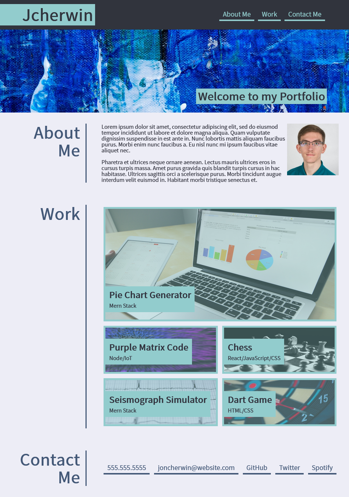

# Portfolio Works Page

## Description

This project combines the CSS skills of: flexbox, media queries, variables, transitions, and imported user fonts. It serves as a working example that can be used as a professional job-ready portfolio. This project is also reposponsive on screen sizes as small at 380px in width.

## Link

This is a link to the project hosted on GitHub Pages: [https://choosealicense.com/](https://choosealicense.com/)

## Usage

This image is an example of what to expect when viewing the complete webpage.

